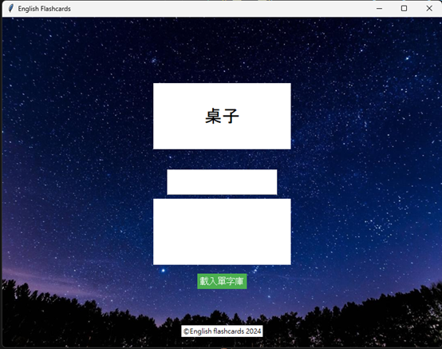

# English Flashcards App



## Overview
An interactive vocabulary learning tool with a modern GUI that helps users practice English translations of Chinese words through flashcards.

## Features
- Rounded-corner UI design with background image
- Custom vocabulary file support (.txt format)
- Instant answer verification with visual feedback
- Automatic next-word generation
- Error handling for file operations
- Cross-platform compatibility

## Requirements
- Python 3.x
- Pillow library (`pip install Pillow`)
- Tkinter (usually included with Python)

## Installation
```bash
pip install Pillow
git clone https://github.com/yourusername/flashcards-app.git
cd flashcards-app
```

## Usage
1. Run main.py
2. Click "載入單字庫" to load vocabulary (format: Chinese: English)
3. Type answers in the input field
4. Press Enter to check answers
5. App automatically progresses to next word after 1.5 seconds

##  Custom Vocabulary
Create a .txt file with lines formatted:
```bash
中文詞: English word
範例: example
```
